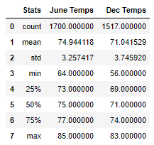
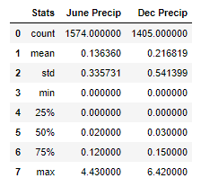

# surfs_up

# Week 9 Challenge

## Background
We have discovered a love for surfing while on vacation in Hawaii and would like to invest some savings in a surf and ice cream shop.  However, we need to persuade other investors, like W.Avey, to contribute to our business.  We will do this by analyzing weather data W.avy provided to confirm there will be enough customers between seasons to sustain business throughout the year.  

### Objectives
The goals of this challenge are to:

* Determine key statistical data about the month of June.
* Determine key statistical data about the month of December.
* Compare your findings between the month of June and December.
* Make 2 or 3 recommendations for further analysis.
* Share your findings in the Jupyter Notebook.

## Resources
Data: hawaii.sqlite (file provided)

Python 3.7.7
Jupyter Notebook
Modules/Libraries:  sqlalchemy, pandas, matplotlib, numpy, datetime

Note:  a starter .ipynb was provided with dependencies & psuedocode to walk through the week's modules

## Analysis 
Data is provided in the form of an sqlite file/database.  This existing database is reflected into our new model.  We pull these tables into pandas dataframes for explatory analysis.  Queries and filters are used to extract data to answer questions posed in the modules.  Histograms are created and reviewed.  

For the challenge activity, I pulled the data from the Measurement class into a pandas df with the read_sql_query function.  Once in the df, I used DatetimeIndex to pull the month out of the date column and put into a new column as an integer.  With this information, we can create df's for June & December respectively by using the .loc function.  Next, df's are created with .describe() to obtain descriptive statistics for both months for temperature and precipitation.  These df's are concatonated and cleaned up to summarize and to plot bar charts.

All code found in the Jupyter Notebook file: [climate_analysis.ipynb](climate_analysis.ipynb)

### Temperature Analysis

The descriptive statistics for Temperture data are shown in table format. 

 

One of the best ways to compare 2 sets of data is a bar chart. 

 

#### Observations:

key differences in weather between June and December

### Precipitation Analysis

The descriptive statistics for Temperture data are shown in table format. 

 

One of the best ways to compare 2 sets of data is a bar chart. 

 

#### Observations:

key differences in weather between June and December

## Recommendations for Future Analysis

Need 2-3
Due to the fact that the means and 3rd quartiles of Precipitation data for both June & Dec are much lower than the max values, it would be prudent to investigate outliers in the data.  I would create box and whisker plots to visualize this data 

