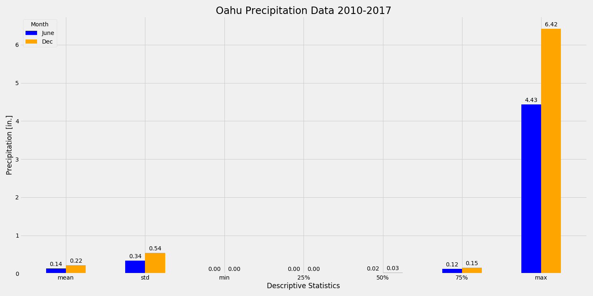

# surfs_up

# Week 9 Challenge

## Background
We have discovered a love for surfing while on vacation in Hawaii and would like to invest some savings in a surf and ice cream shop.  However, we need to persuade other investors, like W.Avey, to contribute to our business.  We will do this by analyzing weather data W.avy provided to confirm there will be enough customers between seasons to sustain business throughout the year.  

### Objectives
The goals of this challenge are to:

* Determine key statistical data about the month of June.
* Determine key statistical data about the month of December.
* Compare your findings between the month of June and December.
* Make 2 or 3 recommendations for further analysis.
* Share your findings in the Jupyter Notebook.

## Resources
Data: hawaii.sqlite (file provided)

Python 3.7.7 
Jupyter Notebook 
Modules/Libraries:  sqlalchemy, pandas, matplotlib, numpy, datetime

Note:  a starter .ipynb was provided with dependencies & psuedocode to walk through the week's modules

## Analysis 
Data is provided in the form of an sqlite file/database.  This existing database is reflected into our new model.  We pull these tables into pandas dataframes for explatory analysis.  Queries and filters are used to extract data to answer questions posed in the modules.  Histograms are created and reviewed.  

For the challenge activity, I pulled the data from the Measurement class into a pandas df with the read_sql_query function.  Once in the df, I used DatetimeIndex to pull the month out of the date column and put into a new column as an integer.  With this information, we can create df's for June & December respectively by using the .loc function.  Next, df's are created with .describe() to obtain descriptive statistics for both months for temperature and precipitation.  These df's are concatonated and cleaned up to summarize and to plot bar charts.

All code found in the Jupyter Notebook file: [climate_analysis.ipynb](climate_analysis.ipynb)

### Temperature Analysis

The descriptive statistics for Temperture data are shown in table format. 

 

One of the best ways to compare 2 sets of data is a bar chart. 

 

#### Observations:

There seems to be little difference between temperatures in June & December.  The difference is only ~2-4°F in mean, max, and the quartiles.  
December does have a significantly lower min temperature than June.  However, most of the December temperatures are above 69°F (1st quartile).
The standard deviation is not much different for June & December.  This demonstrates that the temperature variance is similar for both months.

### Precipitation Analysis

The descriptive statistics for Temperture data are shown in table format. 

 

One of the best ways to compare 2 sets of data is a bar chart. 

 

#### Observations:

Mean amount of precipitation is 0.14 inches for June and 0.22 inches for December (almost double).  
According to:  [https://www.weathershack.com/static/ed-rain-measurement.html].(https://www.weathershack.com/static/ed-rain-measurement.html)
*Rainfall rate is generally described as light, moderate or heavy. Light rainfall is considered less than 0.10 inches of rain per hour. Moderate rainfall measures 0.10 to 0.30 inches of rain per hour. Heavy rainfall is more than 0.30 inches of rain per hour.*
With that information, we can say that most of the rain events in these 2 months would be classified as light rainfall.
December has a higher standard deviation, which demonstrates more variance 
This is supported by looking at the max values for June (4.43") and December (6.42") as compared to the 3rd quartile (0.12" and 0.15" respectively)
So, most of the data for both months are less than or equal to (0.12" and 0.15" respectively). 
Because the 3rd quartiles are so similar and the max values so far apart, you can see why the mean and standard deviation are higher in December.  
Therefore, there is a greater chance for heavier rainfall in December as compared to June, but most of the days will have a similar amount of rainfall.
It also seems that most surfers will not care if it is raining or not, but there may be less business on the ice cream side.  

## Recommendations for Future Analysis

Need 2-3
1. Due to the fact that the means and 3rd quartiles of Precipitation data for both June & Dec are much lower than the max values, it would be prudent to investigate outliers in the data.  I would create box and whisker plots to visualize this data. 
2. It would be nice to have this same analysis for additional months.  At a minimum, I would add 2 months to display descriptive statistics of "all 4 seasons."
3. Investigate other datasets to analyze the high season for surfing and tourists.  Compare to the business plan to confirm assumptions for volume of business.  Potentially adjust business plan for the seasonal changes found in both new and existing datasets.

